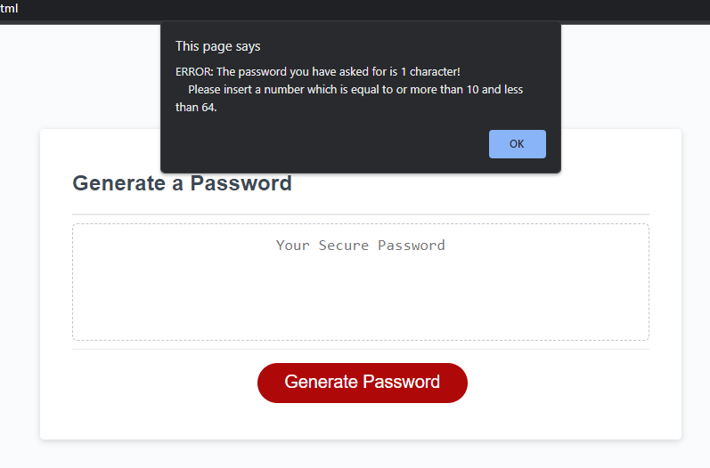
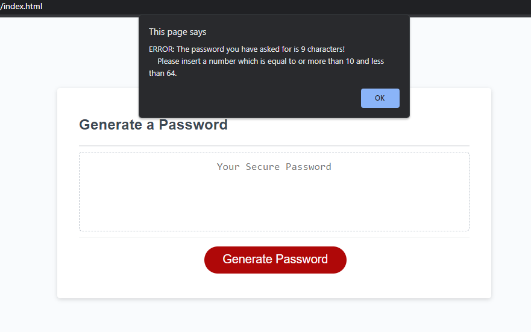
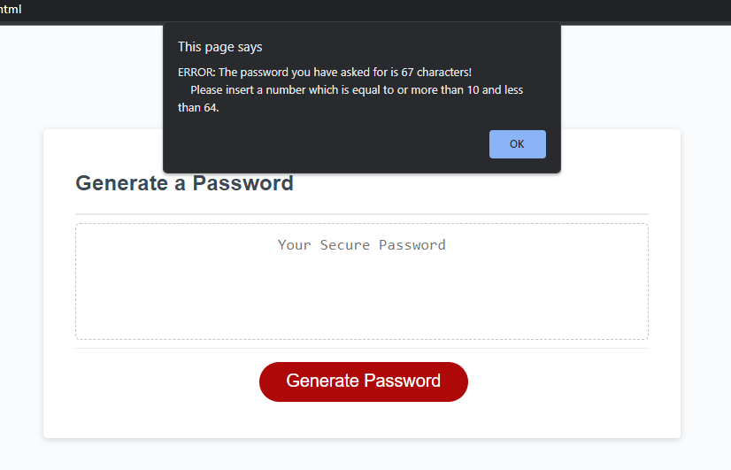
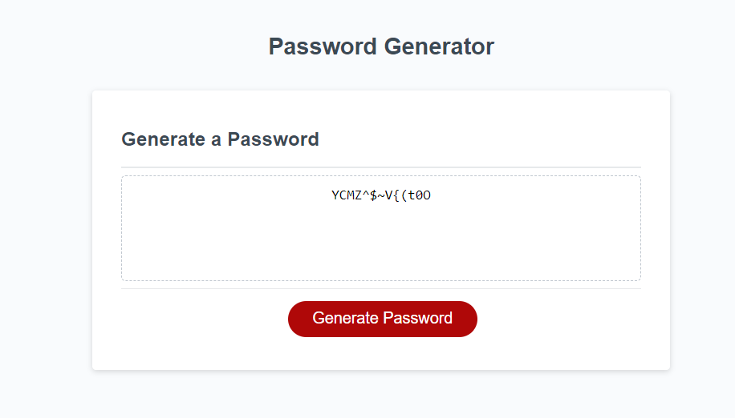

# random-password-generator

RPG- Randon password generator

Using the starter code to create a random password generator we were given some arrays of possible characters to use in a random password generator, as well as some starter code on the structure of how the RPG can be created.

### What was done?

- we were given a 4 arrays with different characters:
  - Uppercase, lowercase, numerical and special characters.
- we then gather the users prefernces this includes which character types they want and the length using the getPasswordOptions funcion
  - ensuring the input is numeric
  - ensuring it is no longer than 64 and no less than 10
  - i also added in a check to see if its 1 character for wording purposes
  - requires that at least one character type is selected
- we than use the arrays given to return a random element using the getRandom function
- we then use the usrs prefernces from getPasswordOptions to create a password in the generatePassword function
- we then use the writePassword function to generate the value

### Below are a couple of images showing the workings:

#### One Character

#### Nine Characters

#### 67 Characters

#### Password generated

Deployed Link: https://balalsaleh.github.io/random-password-generator/
GitHub Repo: https://github.com/balalsaleh/random-password-generator
